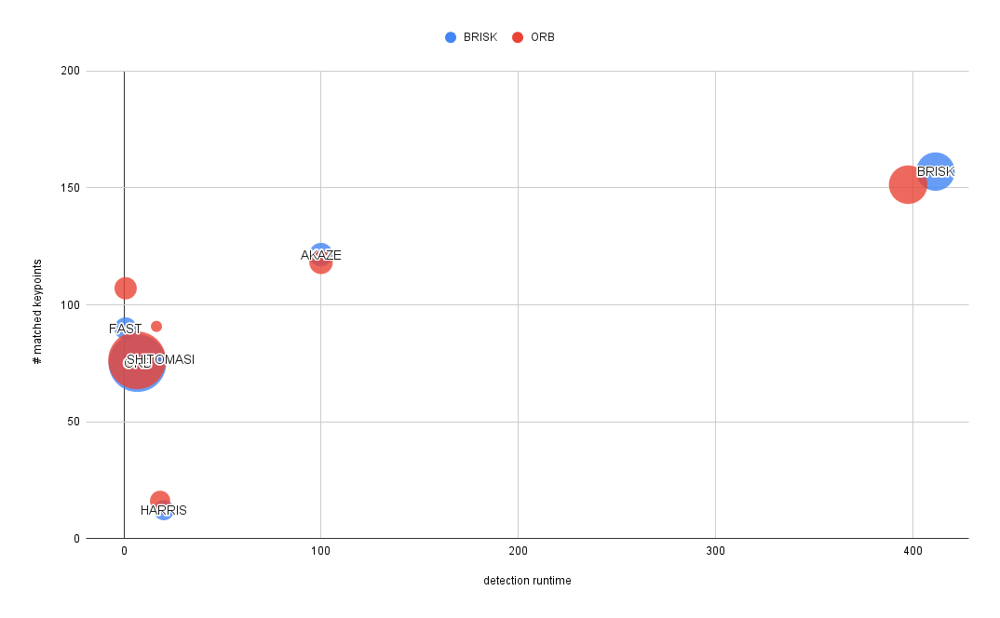

# SFND 2D Feature Tracking

## Data Buffer Optimization
See implementation in `processImageSeq`.

## Keypoint Detection

Refer to `detKeypoints`. Merged all detection algorithms under the same function with the same signature.

## Keypoint Removal

See implementation in `processImageSeq`.

## Keypoint Descriptors

Refer to `descKeypoints`.

## Descriptor Matching

See implementation in `matchDescriptors`.

## Descriptor Distance Ratio

See implementation in `matchDescriptors`.

## Performance Evaluation

All raw data and the corresponding pivot table can be found in XLSX file at the root. In the code, all performance data
is stored in a vector of `struct performancePoint`. We compute the average size of keypoints across an image and the standard
deviation of the size. Some algorithms use fixed-size keypoints.

The number of keypoints extracted varies widely by algorithm as does the number of matched points.

There is a tradeoff between number of matched points and runtime, but for purposes of real systems, speed is so important
that the top three detector/descriptor combos are (FAST/BRISK), (FAST/ORB), (ORB/ORB).

 
In the diagram the bubble diameter represents the average size of the keypoints, i.e. how much of the surroundings of a 
keypoint is encoded. Descriptors SIFT and FREAK failed with memory overflows or other exceptions from within OpenCV and could not be evaluated.

